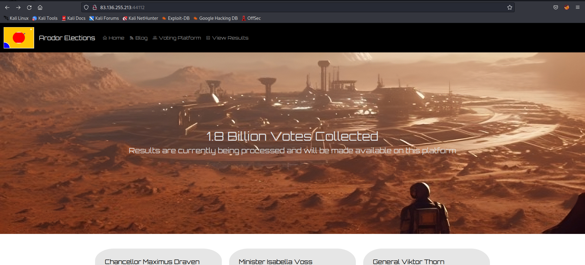

# Lazy Ballot
>As a Zenium State hacker, your mission is to breach Arodor's secure election system, subtly manipulating the results to create political chaos and destabilize their government, ultimately giving Zenium State an advantage in the global power struggle.

## About the Challenge
We have been given a source code (You can download the source code and also we got a website to test. 
Here is the preview of the website:

